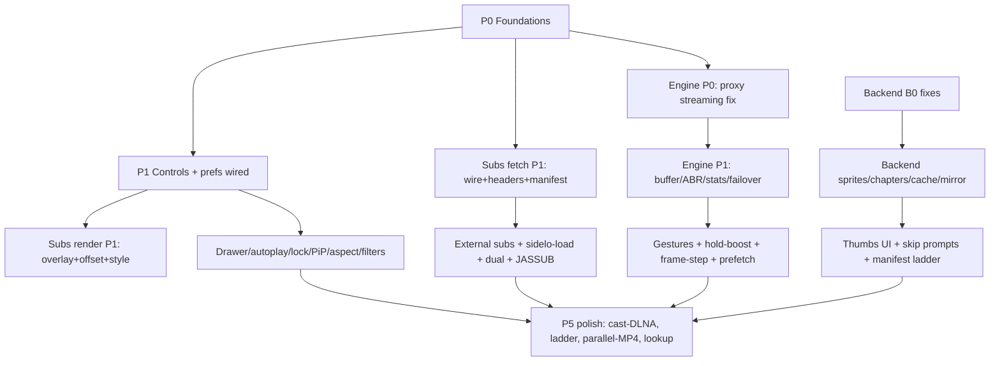

# 10 — Execution Plan (Phases, DAG, Tests, Acceptance)

## Phase DAG

P0 and B0 parallelizable day-1 (different trees: Next vs Rust vs Nest).

## P0 Foundations (blocking, no user features)

| # | Task | Files | Done when |
|---|---|---|---|
| P0-1 | Streaming `/api/proxy` (no buffer) + `/api/mb` stream passthrough | `src/app/api/mb/[...path]/route.ts`, `next.config.ts` or new `src/app/api/proxy/[...]/route.ts` | 1GB segment, no OOM, no 30s drop |
| P0-2 | Session-owned transcode headers (no 30m death) + janitor + `transcode_file` Range+stream | `main.rs` | 2h transcode survives; 206 served |
| P0-3 | `resource_id` thread + subtitle header parity + early-exit verified | `api.ts`, `watch-player.tsx:394-437`, `service.rs`, `adapt.rs` | subtitle 403s gone; fan-out skipped when ≥5 tracks |
| P0-4 | `player-prefs.ts` + tests, wire seek/vol/autoplay/buffer seeds | `src/lib/*`, `watch-player.tsx` | anon prefs persist reload |
| P0-5 | Nest `User.settings JSON` + DTO + service + contract lockstep (backend first) | `schema.prisma`, `account.types.ts`, `update-user.dto.ts`, `users.service.ts`, `account.ts`, `session-contract.ts`, `session.tsx` | subset syncs cross-device |
| P0-6 | Icons batch + `useDismissable` extract + `CcIcon` wire | `icons.tsx`, `hooks/use-dismissable.ts`, `watch-player.tsx` | no behavior change, `npm test` green |

## P1 Controls & player chrome

P1-1 replay (01.2) · P1-2 seek buttons + interval pref (01.3) · P1-3 timestamp toggle (01.4) · P1-4 hover timecode tooltip (01.5-P1) · P1-5 chapter renderer + wire types (01.7) · P1-6 speed presets + slider + pitch lock (03.1-3.3) · P1-7 volume boost/normalize (04.1) · P1-8 audio-track list-if-present (04.2-P1) · P1-9 one-tap CC (04.3) · P1-10 drawer + prev/next + autoplay pref (04.4) · P1-11 lock (04.5) · P1-12 aspect + filters/night (04.6-4.7) · P1-13 PiP + AirPlay-if-present (04.8-4.9P1) · P1-14 stats overlay (07.6).

## P2 Subtitles

P2-A (fetch): schema widen + dedupe key (05.1) · manifest extraction + rewrite (05.2) · provider-cap gating (05.6) · lang auto-select + forced (05.5) · side-load (05.4).
P2-B (render): overlay + parsers (ASS strip/TTML) + `sub-style.ts` (06-P2) · dual mode (06.1) · offset slider + G/H (06.3) · SDH badges (06.4) · style UI (06.5-P2).
P4-B (advanced): external provider search (05.3) · JASSUB WASM (06-P4) · signs filter (06.2) · word lookup (06-P4) · silence skip lives 03-P4.

## P3 Engine

P3-A: proxy streaming (P0-1) · Range (P0-2). P3-B: EWMA + dynamic buffer (07.1) · fast-start seed (07.2) · fetch priority (07.3) · backBuffer pref (07.5) · stats (07.6) · client mirror failover via `exclude`/rotate (07 + 08-B4). P4-C/P5: gestures (02) · hold-boost (02.4) · fine-scrub (01.6) · frame step (03.5) · prefetch worker + Cache API (07.4) · sub-parse worker (07.8) · parallel MP4 (07.7-P5).

## P4 Backend features (B1)

B1-1 sprites + whitelist + VTT + client tooltip (08-B1 → 01.5-P4). B1-2 IDs + `/api/skip-markers` + ffprobe + client chapters/prompts (08-B2 → 01.7/04.4). B1-3 manifest cache + rewrite unification (08-B3). B1-4 mirror probe/rotate (08-B4). B1-5 health `transcode` field (08-B6).

## P5 Polish

Chromecast (needs public-URL receiver — backend), DLNA discover, transcode ladder (`-var_stream_map`), multi-audio transcode, single-frame thumb endpoint, JMDict lookup backend, `parallelMp4` default-on evaluation.

## Test plan (per phase, vitest + smoke)

- Unit (new): `seek` (+steps/sensitivity), `playback-rate`, `gestures`, `bandwidth`, `stream-health`, `stats`, `sub-style`, `captions` (+ASS/TTML/shift/classify), `player-prefs`, `episode-nav`. Keep pattern: one `describe` per function, boundary cases (null/NaN/Inf/0/rollover).
- Keep green: `seek-{routing,pin,commit}`, `raf-display`, `transcode-window`, `watch-sync`, `history(-merge)`, `session-contract`, `api(-account)`, `playback`, `format`, `types`, `media-types`.
- Rust: `cargo fmt --check`, `cargo clippy --all-targets --locked -- -D warnings`, backend route smoke (`/skip-markers`, `/transcode/*/sprites`, Range 206).
- Nest: `prisma generate` + migration dry-run; DTO validation test (whitelist drops unknown, nested player passes).
- Smoke (real playback, every phase): `npm run dev` → direct + HEVC-transcode titles → seek (direct + remote restart) → CC on/off → quality switch → pause/unmount flush → resume prompt. P3+: throttle to 3G (buffer target), 2h title (heap), next-episode prefetch (no stray ffmpeg).
- No permanent tests for: wiring copies, mock echoes, bare not-throw, duplicate same-path rows.

## Acceptance (ship-blocking)

1. All P0-P1 tasks done; P2-A + P2-B done; P3-B done; B0 done. P4+ phase-gated (each shippable independently).
2. `npm test` green; clippy/fmt clean; no new lint (none exists — `npx tsc --noEmit` ad hoc).
3. Playback smoke passes on direct + transcode + anime paths with no regression in resume/next-up/sync.
4. No stubs/placeholders/`TODO: implement`/dead toggles in shipped phases.
5. Docs: this folder updated if scope moves; `../video-player-enhancement.md` stays spec source.
