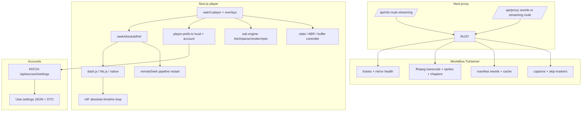

# Video Player Enhancement — Implementation Plan Index

Source spec: `docs/plans/video-player-enhancement.md` (3 sections, ~60 features).
Scope: movie + anime player (`src/components/watch-player.tsx`, 2131 lines) + subtitle pipeline + streaming engine + Rust proxy/transcode + prefs persistence.

Status: PLAN ONLY — no code changed. Grounded 2026-09-28 by 5 parallel audits (UI, engine, subs, session, backend).

## Current state (facts)

- Single monolith owns everything: engine select (native / dash.js / hls.js / server transcode), timeline, overlays, sync — `src/components/watch-player.tsx:58-2131`.
- Two clocks: media element timeline + absolute source timeline (`playbackOffsetRef + currentTime` vs `totalDurationRef ?? manifestTotalRef`, rAF `watch-player.tsx:1437-1494`). Transcode path is a sliding HLS live window — `video.duration` = window length, never title length.
- Single seek entry: `seekAbsoluteRef.current(abs)` (`:1231-1310`) with pin/watchdog/storm-guard. All new seek affordances MUST route through it.
- Subs: SRT/VTT-only, moviebox-only (`if provider !== 'moviebox' return []` at `:395`), single track, hardcoded `srclang 'en'` (`captions.ts:120`), label-only identity (`:81`), no offset/style/dual/ASS.
- Engine defaults: hls.js `maxBufferLength: 40, backBufferLength: Infinity` (`:575`); dash.js stock; no EWMA tuning, no fast-start, no prefetch, no IndexedDB cache.
- Backend (`MovieBox-Tui/server/src/main.rs`, 2270 lines, 24 routes): ticket TTL 30 min no renewal, transcode idle 20 min lazy prune, ffmpeg single rendition `libx264 veryfast crf24 / 6s TS / -hls_list_size 0 / -map 0:v:0 -map 0:a:0`, `transcode_file` whole-read no Range, filename whitelist blocks sprites.
- Transport: `/api/mb/*` route handler buffers fully (120s timeout); `/api/proxy/:ticket` rewrite streams with ~30s drop wall. Subtitle fetch sends `headers: []` → silent 403s on Referer-gated CDNs.
- Prefs: zero infra. Player destructures only `status` from `useSession()`; `AccountSettings` flat scalars; `watch-sync.ts` module singleton + 8s throttle + duplicated `0.98` completion rule.
- Tests: `vitest run`, `src/**/*.{test,spec}.ts(x)`. Pure helpers pinned (`seek-*`, `raf-display`, `transcode-window`, `captions`, `playback`, `watch-sync`).

## Target architecture

## Folder map

| File | Covers spec |
|---|---|
| `README.md` (this) | index, risks, phases |
| [01-controls-timeline.md](./01-controls-timeline.md) | §1 primary playback, seek buttons, scrub bar, timestamp, thumbnails, fine-scrub, chapters |
| [02-gestures.md](./02-gestures.md) | §1 touch gestures (double-tap, swipe, hold-boost, pinch) |
| [03-speed-precision.md](./03-speed-precision.md) | §1 speed switcher/slider, pitch lock, silence skip, frame step |
| [04-audio-episode-display.md](./04-audio-episode-display.md) | §1 volume/audio tracks, episode drawer/nav/skip/autoplay, lock/orientation/filters/PiP/cast/quality/stats |
| [05-subtitles-fetch-tracks.md](./05-subtitles-fetch-tracks.md) | §2 track mgmt, formats passthrough, HLS/DASH extraction, external fetch, side-load, lang prefs, forced |
| [06-subtitles-render-style-sync.md](./06-subtitles-render-style-sync.md) | §2 ASS/WASM, dual, signs/lyrics, word lookup, offset, SDH, typography/color/position |
| [07-streaming-engine.md](./07-streaming-engine.md) | §3 client buffer/ABR/prefetch/cache/workers/GC |
| [08-backend-proxy-transcode.md](./08-backend-proxy-transcode.md) | §3 Rust: sprites, skip/chapters, manifest cache, mirror rotation, ticket TTL, streaming, ladder |
| [09-prefs-persistence.md](./09-prefs-persistence.md) | prefs infra local + account (all sections' settings) |
| [10-execution-plan.md](./10-execution-plan.md) | P0-P5 phases, task DAG, test plan, acceptance |

## Phase map (see [10-execution-plan.md](./10-execution-plan.md) for DAG)

- **P0 Foundations (blocking):** streaming `/api/proxy` fix, ticket-renewal, `resource_id` + header parity, `player-prefs.ts`, `PlayerPrefs` DTO+JSON column (backend-first), icon set, `useDismissable` extract. No user features.
- **P1 Controls + timeline:** replay, ±seek buttons, remaining-time toggle, chapter notches (static fallback), speed presets (basic `playbackRate`), volume boost (gain), episode drawer + prev/next, autoplay opt-out, PiP, lock, aspect. All through `seekAbsoluteRef`.
- **P2 Subs v1:** wire format/lang/forced/SDH fields, HLS/DASH extraction display, side-load, offset slider + G/H keys, persist lang pairing, fix 403s + early-exit.
- **P3 Streaming v1:** buffer/ABR tuning, fast-start, fetch priority, back-buffer cap fix, stats overlay, mirror failover (client), CDN error surfacing.
- **P4 Advanced:** thumbnail sprites (needs backend), fine-scrub, gestures, hold-boost, frame step, dual subs, JASSUB/WASM, signs/lyrics filter, word lookup, silence skip, cast, filters/night, prefetch/seeding, IndexedDB range cache, manifest edge cache.
- **P5 Polish:** SDH badges, typography engine, chapter sourcing (AniSkip/ffprobe), multi-rendition transcode, parallel chunk workers.

Rule: P0 before P1; backend-before-frontend on any wire change (`whitelist:true` drops unknown keys silently).

## Cross-cutting constraints (do not violate)

1. Transcode live window: never use `video.duration/currentTime` directly — use `absolutePosition()/absoluteDuration()` + `seekAbsolute`.
2. Remote seeks cost a full ffmpeg restart (seconds). Debounce via `queuedRemoteSeekRef`; never storm.
3. rAF loop is empty-deps, ref-only. New frame-accurate UI uses refs, not state (state re-renders `<video>`).
4. `touch-action: pan-y` on `.player-range` conflicts with vertical gestures — new gesture surface, don't mutate range input.
5. `backBufferLength: Infinity` is intentional today; 15s rolling buffer is a behavior change, gate behind pref.
6. `SubtitleOption` extension crosses `providers/models.rs → adapt.rs → service.rs (dedupe!) → main.rs → types.ts → player`. Widen dedupe key first.
7. `watch-sync.ts` singleton = one player instance. PiP/background-audio must scope or accept single-owner.
8. `0.98` completion rule duplicated (`history.ts:48`, `watch-sync.ts:64`) — move together with replay/autoplay changes.
9. Icons follow `base(p)` stroke convention in `icons.tsx`; wire unused `CcIcon` first.
10. No new provider/prop without threading `watch-player.tsx:33 + watch-client.tsx:9 + page.tsx VALID + ProviderId`.

## Risk register (top 8)

| # | Risk | Mitigation |
|---|---|---|
| R1 | `/api/proxy` 30s drop kills segments | P0: streaming route handler (no `arrayBuffer`), or reverse-proxy timeout |
| R2 | Ticket expires mid-transcode (30m) | P0: session renews ticket / internal ref |
| R3 | Whitelist drops new prefs silently | P0: land Nest DTO + Prisma first, then client |
| R4 | Native TextTrack ceiling blocks ASS/dual/style | P2 decision: keep native + CSS `::cue` subset vs canvas/WASM renderer |
| R5 | Gesture/seek storm on transcode restarts | Debounce + `flashNotice` HUD, reuse storm guard |
| R6 | Unbounded SourceBuffer (`Infinity`) | P3: cap with pref default, verify seek-back |
| R7 | Caption 403s (empty headers) | P0: forward `SourceMirror.headers` or server-minted tickets |
| R8 | 2131-line component collapse | Extract overlays/hooks incrementally; no big-bang rewrite |

## How to execute

1. Read `10-execution-plan.md` for ordered task DAG.
2. Per-feature file has file-by-file tasks with symbols + acceptance.
3. Run `npm test` (vitest) after each phase; smoke real playback (`npm run dev`, seek/transcode/CC paths).
4. Keep original spec `../video-player-enhancement.md` as source of truth; these files are the build plan.
